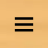
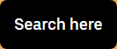
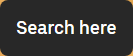
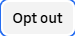
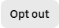
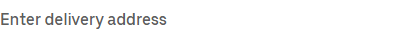
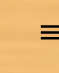
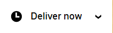

# ubereats Design System

You are building UI for **ubereats**. Light-themed, cool palette, sans-serif typography (UberMove), compact density on a 4px grid.

## Visual Reference

**IMPORTANT**: Study ALL screenshots below before writing any UI. Match colors, typography, spacing, layout, and motion exactly as shown.

### Homepage


### Scroll Journey (Cinematic Visual States)

> These screenshots capture the website at different scroll depths. The design changes dramatically as you scroll — each frame shows a different cinematic state. Replicate these exact visual transitions.

#### 0% — Hero / Above the fold


#### 17% — Mid-page at 17% scroll


#### 33% — Mid-page at 33% scroll


#### 50% — Mid-page at 50% scroll


#### 67% — Mid-page at 67% scroll


#### 83% — Mid-page at 83% scroll


#### 100% — Footer / End of page


> Read `references/DESIGN.md` for full token details. Read `references/ANIMATIONS.md` for motion specs. Read `references/LAYOUT.md` for layout structure. Read `references/COMPONENTS.md` for component patterns.

## Ultra Reference Files

This package includes extended documentation. **Read these files before implementing:**

| File | Contents |
|------|----------|
| `references/DESIGN.md` | Full design system tokens, colors, typography, spacing |
| `references/VISUAL_GUIDE.md` | **START HERE** — Master visual guide with all screenshots embedded |
| `references/ANIMATIONS.md` | CSS keyframes, scroll triggers, motion library stack, video specs |
| `references/LAYOUT.md` | Flex/grid containers, page structure, spacing relationships |
| `references/COMPONENTS.md` | DOM component patterns, HTML structure, class fingerprints |
| `references/INTERACTIONS.md` | Hover/focus states with before/after style diffs |
| `screens/scroll/` | 7 scroll journey screenshots showing cinematic states |

### Animation Stack Detected

- **Web Animations API (2 active)** — animation

## Design Philosophy

- **Layered depth** — use shadow tokens to create a sense of physical layering. Each elevation level has a specific shadow.
- **Gradient accents** — gradients are used thoughtfully for emphasis, not decoration.
- **Type pairing** — UberMove for body/UI text, UberMoveText for headings/display. Never introduce a third typeface.
- **compact density** — 4px base grid. Every dimension is a multiple of 4.
- **cool palette** — the color temperature runs cool, matching the sans-serif typography.
- **Restrained accent** — `#dfeffe` is the only pop of color. Used exclusively for CTAs, links, focus rings, and active states.
- **Subtle motion** — transitions smooth state changes. Keep durations under 300ms, use ease-out curves.

## Color System

### Core Palette

| Role | Token | Hex | Use |
|------|-------|-----|-----|
| Background | `--background` | `#ffffff` | Page/app background |
| Surface | `--surface` | `#fee6e1` | Cards, panels, modals |
| Text Primary | `--text-primary` | `#000000` | Headings, body text |
| Text Muted | `--text-muted` | `#6b6b6b` | Captions, placeholders |
| Accent | `--accent` | `#dfeffe` | CTAs, links, focus rings |
| Border | `--border` | `#272727` | Dividers, card borders |

### Status Colors

| Status | Hex | Use |
|--------|-----|-----|
| Success | `#75e190` | Confirmations, positive trends |
| Danger | `#3a0501` | Errors, destructive actions |

### Extended Palette

- **base-background-statelayer-hover:** `#111111` — Deep background layer or shadow color
- **base-background-disabled:** `#e0e0e0`
- **base-background-inverse-statelayer-hover:** `#ececec` — Light surface or highlight color
- **base-border-inverse-subtle:** `#474747` — Secondary text, placeholder text
- **base-background-disabled:** `#5f5f5f`
- **base-border-subtle:** `#c4c4c4` — Secondary text, placeholder text
- **base-error-border-subtle:** `#feac9c` — Destructive actions, error states
- **base-error-background-disabled:** `#4e0600` — Destructive actions, error states

### CSS Variable Tokens

```css
--base-background-base: var(--base-neutral-99);
--base-background-primary: var(--base-neutral-100);
--base-background-secondary: var(--base-neutral-98);
--base-background-tertiary: var(--base-neutral-96);
--base-background-disabled: rgba(224,224,224,0.6);
--base-error-background-bold: var(--base-red-53);
--base-error-background-subtle: var(--base-red-96);
--base-error-background-disabled: rgba(254,230,225,0.75);
--base-error-background-statelayer-hover: rgba(254,230,225,0.25);
--base-error-background-statelayer-pressed: rgba(254,230,225,0.5);
--base-warning-background-bold: var(--base-orange-74);
--base-warning-background-subtle: var(--base-orange-96);
--base-warning-background-disabled: rgba(255,232,214,0.75);
--base-success-background-bold: var(--base-green-53);
--base-success-background-subtle: var(--base-green-98);
--base-success-background-disabled: rgba(204,251,203,0.75);
--base-info-background-bold: var(--base-neutral-18);
--base-info-background-subtle: var(--base-neutral-96);
--base-info-background-disabled: rgba(224,224,224,0.75);
--base-accent-background-primary-bold: var(--base-blue-57);
```

## Typography

### Font Stack

- **UberMove** — Heading 1, Heading 2, Heading 3
- **UberMoveText** — Body, Caption

### Font Sources

```css
@font-face {
  font-family: "UberMove";
  src: url("fonts/UberMove-Regular.woff2") format("woff2");
  font-weight: 400;
}
@font-face {
  font-family: "UberMove";
  src: url("fonts/UberMove-700.woff2") format("woff2");
  font-weight: 700;
}
@font-face {
  font-family: "UberMoveText";
  src: url("fonts/UberMoveText-Regular.woff2") format("woff2");
  font-weight: 400;
}
@font-face {
  font-family: "SpeedeeApp";
  src: url("fonts/SpeedeeApp-Regular.woff2") format("woff2");
  font-weight: 400;
}
@font-face {
  font-family: "Postmates";
  src: url("fonts/Postmates-Regular.woff2") format("woff2");
  font-weight: 400;
}
@font-face {
  font-family: "Postmates";
  src: url("fonts/Postmates-700.woff2") format("woff2");
  font-weight: 700;
}
@font-face {
  font-family: "GTAmerican";
  src: url("fonts/GTAmerican-Regular.woff") format("woff");
  font-weight: 400;
}
@font-face {
  font-family: "Montserrat";
  src: url("fonts/Montserrat-Bold.ttf") format("truetype");
  font-weight: 700;
}
@font-face {
  font-family: "Montserrat";
  src: url("fonts/Montserrat-Regular.ttf") format("truetype");
  font-weight: 400;
}
@font-face {
  font-family: "OrchidText";
  src: url("fonts/OrchidText-Regular.woff2") format("woff2");
  font-weight: 400;
}
@font-face {
  font-family: "OrchidTextSemibold";
  src: url("fonts/OrchidTextSemibold-600.woff2") format("woff2");
  font-weight: 600;
}
@font-face {
  font-family: "OrchidSubheadSemibold";
  src: url("fonts/OrchidSubheadSemibold-700.woff2") format("woff2");
  font-weight: 700;
}
@font-face {
  font-family: "OrchidSubtitleBold";
  src: url("fonts/OrchidSubtitleBold-700.woff2") format("woff2");
  font-weight: 700;
}
```

### Type Scale

| Role | Family | Size | Weight |
|------|--------|------|--------|
| Heading 1 | UberMove | 52px | 700 |
| Heading 2 | UberMove | 36px | 700 |
| Heading 3 | UberMove | 28px | 700 |
| Body | UberMoveText | 16px | 400 |
| Caption | UberMoveText | 14px | 400 |

### Typography Rules

- Body/UI: **UberMove**, Headings: **UberMoveText** — these are the only display fonts
- Max 3-4 font sizes per screen
- Headings: weight 600-700, body: weight 400
- Use color and opacity for text hierarchy, not additional font sizes
- Line height: 1.5 for body, 1.2 for headings

## Spacing & Layout

### Base Grid: 4px

Every dimension (margin, padding, gap, width, height) must be a multiple of **4px**.

### Spacing Scale

`2, 4, 8, 10, 12, 14, 16, 18, 20, 24, 28, 32` px

### Spacing as Meaning

| Spacing | Use |
|---------|-----|
| 4-8px | Tight: related items (icon + label, avatar + name) |
| 12-16px | Medium: between groups within a section |
| 24-32px | Wide: between distinct sections |
| 48px+ | Vast: major page section breaks |

### Border Radius

Scale: `4px, 8px, 12px, 15%, 500px`
Default: `12px`

### Container

Max-width: `1280px`, centered with auto margins.

## Component Patterns

### Card

```css
.card {
  background: #fee6e1;
  border: 1px solid #272727;
  border-radius: 12px;
  padding: 16px;
  box-shadow: 0px 0px 8px rgba(0,0,0,0.1),0px 4px 4px rgba(0,0,0,0.04);
}
```

```html
<div class="card">
  <h3>Card Title</h3>
  <p>Card content goes here.</p>
</div>
```

### Button

```css
/* Primary */
.btn-primary {
  background: #dfeffe;
  color: #000000;
  border-radius: 12px;
  padding: 8px 16px;
  font-weight: 500;
  transition: opacity 150ms ease;
}
.btn-primary:hover { opacity: 0.9; }

/* Ghost */
.btn-ghost {
  background: transparent;
  border: 1px solid #272727;
  color: #000000;
  border-radius: 12px;
  padding: 8px 16px;
}
```

```html
<button class="btn-primary">Get Started</button>
<button class="btn-ghost">Learn More</button>
```

### Input

```css
.input {
  background: #ffffff;
  border: 1px solid #272727;
  border-radius: 12px;
  padding: 8px 12px;
  color: #000000;
  font-size: 14px;
}
.input:focus { border-color: #dfeffe; outline: none; }
```

```html
<input class="input" type="text" placeholder="Search..." />
```

### Badge / Chip

```css
.badge {
  display: inline-flex;
  align-items: center;
  padding: 4px 8px;
  border-radius: 9999px;
  font-size: 12px;
  font-weight: 500;
  background: #fee6e1;
  color: #6b6b6b;
}
```

```html
<span class="badge">New</span>
<span class="badge">Beta</span>
```

### Modal / Dialog

```css
.modal-backdrop { background: rgba(0, 0, 0, 0.6); }
.modal {
  background: #fee6e1;
  border: 1px solid #272727;
  border-radius: 500px;
  padding: 24px;
  max-width: 480px;
  width: 90vw;
  box-shadow: 0px 0px 10px rgba(0,0,0,0.1);
}
```

```html
<div class="modal-backdrop">
  <div class="modal">
    <h2>Dialog Title</h2>
    <p>Dialog content.</p>
    <button class="btn-primary">Confirm</button>
    <button class="btn-ghost">Cancel</button>
  </div>
</div>
```

### Table

```css
.table { width: 100%; border-collapse: collapse; }
.table th {
  text-align: left;
  padding: 8px 12px;
  font-weight: 500;
  font-size: 12px;
  color: #6b6b6b;
  text-transform: uppercase;
  letter-spacing: 0.05em;
  border-bottom: 1px solid #272727;
}
.table td {
  padding: 12px;
  border-bottom: 1px solid #272727;
}
```

```html
<table class="table">
  <thead><tr><th>Name</th><th>Status</th><th>Date</th></tr></thead>
  <tbody>
    <tr><td>Item One</td><td>Active</td><td>Jan 1</td></tr>
    <tr><td>Item Two</td><td>Pending</td><td>Jan 2</td></tr>
  </tbody>
</table>
```

### Navigation

```css
.nav {
  display: flex;
  align-items: center;
  gap: 8px;
  padding: 12px 16px;
  border-bottom: 1px solid #272727;
}
.nav-link {
  color: #6b6b6b;
  padding: 8px 12px;
  border-radius: 12px;
  transition: color 150ms;
}
.nav-link:hover { color: #000000; }
.nav-link.active { color: #dfeffe; }
```

```html
<nav class="nav">
  <a href="/" class="nav-link active">Home</a>
  <a href="/about" class="nav-link">About</a>
  <a href="/pricing" class="nav-link">Pricing</a>
  <button class="btn-primary" style="margin-left: auto">Get Started</button>
</nav>
```

### Extracted Components

These components were found in the codebase:

**Button** (`html`)

**Input** (`html`)

**Footer** (`html`)

## Page Structure

The following page sections were detected:

- **Navigation** — Top navigation bar (4 items)
- **Hero** — Hero section (detected from heading structure)
- **Faq** — FAQ/accordion section
- **Footer** — Page footer with links and info (22 items)

When building pages, follow this section order and structure.

## Animation & Motion

This project uses **subtle motion**. Transitions smooth state changes without calling attention.

### CSS Animations

- `_ae`
- `loadingAnimation`

### Motion Tokens

- **Duration scale:** `0ms`, `2s`, `200ms`, `300ms`, `400ms`
- **Easing functions:** `ease-in-out`, `ease`, `cubic-bezier(0,0,1,1)`, `linear`
- **Animated properties:** `opacity`, `width`, `height`

### Motion Guidelines

- **Duration:** Use values from the duration scale above. Short (0ms) for micro-interactions, long (400ms) for page transitions
- **Easing:** Use `ease-in-out` as the default easing curve
- **Direction:** Elements enter from bottom/right, exit to top/left
- **Reduced motion:** Always respect `prefers-reduced-motion` — disable animations when set

## Depth & Elevation

### Shadow Tokens

- Subtle: `0 0 0 2px #276EF1`
- Subtle: `inset 0 0 0 2px #FFFFFF,0 0 0 2px #276EF1`
- Subtle: `inset 0px -1px 0px #F3F3F3`
- Subtle: `rgb(243, 243, 243) 0px -1px 0px 0px inset`
- Raised (cards, buttons): `0px 0px 8px rgba(0,0,0,0.1),0px 4px 4px rgba(0,0,0,0.04)`
- Raised (cards, buttons): `0 1px 4px hsla(0,0%,0%,0.16)`

### Z-Index Scale

`0, 1, 2, 5, 6, 8`

Use these exact values — never invent z-index values.

## Anti-Patterns (Never Do)

- **No blur effects** — no backdrop-blur, no filter: blur()
- **No zebra striping** — tables and lists use borders for separation
- **No invented colors** — every hex value must come from the palette above
- **No arbitrary spacing** — every dimension is a multiple of 4px
- **No extra fonts** — only UberMove and UberMoveText are allowed
- **No arbitrary border-radius** — use the scale: 4px, 8px, 12px, 500px
- **No opacity for disabled states** — use muted colors instead

## Workflow

1. **Read** `references/DESIGN.md` before writing any UI code
2. **Pick colors** from the Color System section — never invent new ones
3. **Set typography** — UberMove, UberMoveText only, using the type scale
4. **Build layout** on the 4px grid — check every margin, padding, gap
5. **Match components** to patterns above before creating new ones
6. **Apply elevation** — use shadow tokens
7. **Validate** — every value traces back to a design token. No magic numbers.

## Brand Spec

- **Favicon:** `/_static/35b3b9a3182fec82.png`
- **Site URL:** `https://www.ubereats.com`
- **Brand color:** `#dfeffe`
- **Brand typeface:** UberMove

## Quick Reference

```
Background:     #ffffff
Surface:        #fee6e1
Text:           #000000 / #6b6b6b
Accent:         #dfeffe
Border:         #272727
Font:           UberMove
Spacing:        4px grid
Radius:         12px
Components:     7 detected
```

## When to Trigger

Activate this skill when:
- Creating new components, pages, or visual elements for ubereats
- Writing CSS, Tailwind classes, styled-components, or inline styles
- Building page layouts, templates, or responsive designs
- Reviewing UI code for design consistency
- The user mentions "ubereats" design, style, UI, or theme
- Generating mockups, wireframes, or visual prototypes

---

# Full Reference Files

> Every output file is embedded below. Claude has full design system context from /skills alone.

## Design System Tokens (DESIGN.md)

# ubereats DESIGN.md

> Auto-generated design system — reverse-engineered via static analysis by skillui.
> Frameworks: None detected
> Colors: 20 · Fonts: 2 · Components: 7
> Icon library: not detected · State: not detected
> Primary theme: light · Dark mode toggle: no · Motion: subtle

## Visual Reference

**Match this design exactly** — study colors, fonts, spacing, and component shapes before writing any UI code.


---

## 1. Visual Theme & Atmosphere

This is a **light-themed** interface with a cool, approachable feel. The light background emphasizes content clarity. Typography pairs **UberMoveText** for display/headings with **UberMove** for body text, creating clear visual hierarchy through type contrast. Spacing follows a **4px base grid** (compact density), with scale: 2, 4, 8, 10, 12, 14, 16, 18px. The accent color **#dfeffe** anchors interactive elements (buttons, links, focus rings). Motion is subtle — smooth transitions (150-300ms) ease state changes without drawing attention.

---

## 2. Color Palette & Roles

| Token | Hex | Role | Use |
|---|---|---|---|
| base-background-material-primary | `#ffffff` | background | Page background, darkest surface |
| base-error-background-disabled | `#fee6e1` | surface | Card and panel backgrounds |
| theme-color | `#000000` | text-primary | Headings and body text |
| base-border-subtle | `#6b6b6b` | text-muted | Captions, placeholders, secondary info |
| base-background-material-primary | `#272727` | border | Dividers, card borders, outlines |
| base-accent-background-primary-disabled | `#dfeffe` | accent | CTAs, links, focus rings, active states |
| base-accent-border-primary-subtle | `#afd7fd` | accent | CTAs, links, focus rings, active states |
| base-warning-border-subtle | `#ffb984` | accent | CTAs, links, focus rings, active states |
| base-error-background-statelayer-hover | `#3a0501` | danger | Error states, destructive actions |
| base-success-border-subtle | `#75e190` | success | Success states, positive indicators |
| base-background-statelayer-hover | `#111111` | unknown | Palette color |
| base-background-disabled | `#e0e0e0` | unknown | Palette color |
| base-background-inverse-statelayer-hover | `#ececec` | unknown | Palette color |
| base-border-inverse-subtle | `#474747` | unknown | Palette color |
| base-background-disabled | `#5f5f5f` | unknown | Palette color |
| base-border-subtle | `#c4c4c4` | unknown | Palette color |
| base-error-border-subtle | `#feac9c` | unknown | Palette color |
| base-error-background-disabled | `#4e0600` | unknown | Palette color |
| base-success-border-subtle | `#17904e` | unknown | Palette color |
| base-success-background-disabled | `#ccfbcb` | unknown | Palette color |

### CSS Variable Tokens

```css
--base-background-base: var(--base-neutral-99);
--base-background-primary: var(--base-neutral-100);
--base-background-secondary: var(--base-neutral-98);
--base-background-tertiary: var(--base-neutral-96);
--base-background-disabled: rgba(224,224,224,0.6);
--base-error-background-bold: var(--base-red-53);
--base-error-background-subtle: var(--base-red-96);
--base-error-background-disabled: rgba(254,230,225,0.75);
--base-error-background-statelayer-hover: rgba(254,230,225,0.25);
--base-error-background-statelayer-pressed: rgba(254,230,225,0.5);
--base-warning-background-bold: var(--base-orange-74);
--base-warning-background-subtle: var(--base-orange-96);
--base-warning-background-disabled: rgba(255,232,214,0.75);
--base-success-background-bold: var(--base-green-53);
--base-success-background-subtle: var(--base-green-98);
--base-success-background-disabled: rgba(204,251,203,0.75);
--base-info-background-bold: var(--base-neutral-18);
--base-info-background-subtle: var(--base-neutral-96);
--base-info-background-disabled: rgba(224,224,224,0.75);
--base-accent-background-primary-bold: var(--base-blue-57);
```


---

## 3. Typography Rules

**Font Stack:**
- **UberMove** — Heading 1, Heading 2, Heading 3
- **UberMoveText** — Body, Caption

**Font Sources:**

```css
@font-face {
  font-family: "UberMove";
  src: url("fonts/UberMove-Regular.woff2") format("woff2");
  font-weight: 400;
}
@font-face {
  font-family: "UberMove";
  src: url("fonts/UberMove-700.woff2") format("woff2");
  font-weight: 700;
}
@font-face {
  font-family: "UberMoveText";
  src: url("fonts/UberMoveText-Regular.woff2") format("woff2");
  font-weight: 400;
}
@font-face {
  font-family: "SpeedeeApp";
  src: url("fonts/SpeedeeApp-Regular.woff2") format("woff2");
  font-weight: 400;
}
@font-face {
  font-family: "Postmates";
  src: url("fonts/Postmates-Regular.woff2") format("woff2");
  font-weight: 400;
}
@font-face {
  font-family: "Postmates";
  src: url("fonts/Postmates-700.woff2") format("woff2");
  font-weight: 700;
}
@font-face {
  font-family: "GTAmerican";
  src: url("fonts/GTAmerican-Regular.woff") format("woff");
  font-weight: 400;
}
@font-face {
  font-family: "Montserrat";
  src: url("fonts/Montserrat-Bold.ttf") format("truetype");
  font-weight: 700;
}
@font-face {
  font-family: "Montserrat";
  src: url("fonts/Montserrat-Regular.ttf") format("truetype");
  font-weight: 400;
}
@font-face {
  font-family: "OrchidText";
  src: url("fonts/OrchidText-Regular.woff2") format("woff2");
  font-weight: 400;
}
@font-face {
  font-family: "OrchidTextSemibold";
  src: url("fonts/OrchidTextSemibold-600.woff2") format("woff2");
  font-weight: 600;
}
@font-face {
  font-family: "OrchidSubheadSemibold";
  src: url("fonts/OrchidSubheadSemibold-700.woff2") format("woff2");
  font-weight: 700;
}
@font-face {
  font-family: "OrchidSubtitleBold";
  src: url("fonts/OrchidSubtitleBold-700.woff2") format("woff2");
  font-weight: 700;
}
```

| Role | Font | Size | Weight |
|---|---|---|---|
| Heading 1 | UberMove | 52px | 700 |
| Heading 2 | UberMove | 36px | 700 |
| Heading 3 | UberMove | 28px | 700 |
| Body | UberMoveText | 16px | 400 |
| Caption | UberMoveText | 14px | 400 |

**Typographic Rules:**
- Limit to 2 font families max per screen
- Use **UberMove** for body/UI text, **UberMoveText** for display/headings
- Maintain consistent hierarchy: no more than 3-4 font sizes per screen
- Headings use bold (600-700), body uses regular (400)
- Line height: 1.5 for body text, 1.2 for headings
- Use color and opacity for secondary hierarchy, not additional font sizes


---

## 4. Component Stylings

### Layout (1)

**Footer** — `html`

### Navigation (1)

**Navigation** — `html`

### Data Input (2)

**Button** — `html`
- Animation: 

**Input** — `html`
- State: :focus, :placeholder

### Media (3)

**Image** — `html`

**Icon** — `html`

**Map/Canvas** — `html`


---

## 5. Layout Principles

- **Base spacing unit:** 4px
- **Spacing scale:** 2, 4, 8, 10, 12, 14, 16, 18, 20, 24, 28, 32
- **Border radius:** 4px, 8px, 12px, 15%, 500px
- **Max content width:** 1280px

**Spacing as Meaning:**
| Spacing | Use |
|---|---|
| 4-8px | Tight: related items within a group |
| 12-16px | Medium: between groups |
| 24-32px | Wide: between sections |
| 48px+ | Vast: major section breaks |


---

## 6. Depth & Elevation

### Flat — subtle depth hints

- `0 0 0 2px #276EF1`
- `inset 0 0 0 2px #FFFFFF,0 0 0 2px #276EF1`
- `inset 0px -1px 0px #F3F3F3`

### Raised — cards, buttons, interactive elements

- `0px 0px 8px rgba(0,0,0,0.1),0px 4px 4px rgba(0,0,0,0.04)`
- `0 1px 4px hsla(0,0%,0%,0.16)`
- `rgba(0, 0, 0, 0.1) 0px 0px 8px 0px, rgba(0, 0, 0, 0.04) 0px 4px 4px 0px`

### Floating — dropdowns, popovers, modals

- `0px 0px 10px rgba(0,0,0,0.1)`
- `rgba(0, 0, 0, 0.16) 0px 4px 16px 0px`

### Overlay — full-screen overlays, top-level dialogs

- `0px 0px 25px rgba(0,0,0,0.1)`
- `inset 999px 999px 0px rgba(0,0,0,0.08)`
- `inset 999px 999px 0px rgba(0,0,0,0.04)`

### Z-Index Scale

`0, 1, 2, 5, 6, 8`


---

## 7. Animation & Motion

This project uses **subtle motion**. Transitions smooth state changes without demanding attention.

### CSS Animations

- `@keyframes _ae`
- `@keyframes loadingAnimation`

### Animated Components

- **Button**: 

### Motion Guidelines

- Duration: 150-300ms for micro-interactions, 300-500ms for page transitions
- Easing: `ease-out` for enters, `ease-in` for exits
- Always respect `prefers-reduced-motion`


---

## 8. Do's and Don'ts

### Do's

- Use `#dfeffe` for interactive elements (buttons, links, focus rings)
- Use `#ffffff` as the primary page background
- Pair **UberMove** (body) with **UberMoveText** (display) — these are the only allowed fonts
- Follow the **4px** spacing grid for all margins, padding, and gaps
- Use the defined shadow tokens for elevation — see Section 6
- Use border-radius from the scale: 4px, 8px, 12px, 15%, 500px
- Reuse existing components from Section 4 before creating new ones

### Don'ts

- Don't introduce colors outside this palette — extend the design tokens first
- Don't introduce additional font families beyond UberMove and UberMoveText
- Don't use arbitrary spacing values — stick to multiples of 4px
- Don't create custom box-shadow values outside the system tokens
- Don't use arbitrary border-radius values — pick from the defined scale
- Don't duplicate component patterns — check Section 4 first
- Don't use backdrop-blur or blur effects

### Anti-Patterns (detected from codebase)

- No blur or backdrop-blur effects
- No zebra striping on tables/lists


---

## 9. Responsive Behavior

No breakpoints detected. Consider adding responsive breakpoints to the design system.

---

## 10. Agent Prompt Guide

Use these as starting points when building new UI:

### Build a Card

```
Background: #fee6e1
Border: 1px solid #272727
Radius: 12px
Padding: 16px
Font: UberMove
Use shadow tokens from Section 6.
```

### Build a Button

```
Primary: bg #dfeffe, text white
Ghost: bg transparent, border #272727
Padding: 8px 16px
Radius: 12px
Hover: opacity 0.9 or lighter shade
Focus: ring with #dfeffe
```

### Build a Page Layout

```
Background: #ffffff
Max-width: 1280px, centered
Grid: 4px base
Responsive: mobile-first, breakpoints from Section 9
```

### Build a Stats Card

```
Surface: #fee6e1
Label: #6b6b6b (muted, 12px, uppercase)
Value: #000000 (primary, 24-32px, bold)
Status: use success/warning/danger from Section 2
```

### Build a Form

```
Input bg: #ffffff
Input border: 1px solid #272727
Focus: border-color #dfeffe
Label: #6b6b6b 12px
Spacing: 16px between fields
Radius: 12px
```

### General Component

```
1. Read DESIGN.md Sections 2-6 for tokens
2. Colors: only from palette
3. Font: UberMove, type scale from Section 3
4. Spacing: 4px grid
5. Components: match patterns from Section 4
6. Elevation: shadow tokens
```

## Visual Guide — Screenshots (VISUAL_GUIDE.md)

# ubereats — Visual Guide

> Master visual reference. Study every screenshot carefully before implementing any UI.
> Match colors, layout, typography, spacing, and motion states exactly.

**Motion Stack:** **Web Animations API (2 active)**

## Scroll Journey

The page has cinematic scroll animations. Each screenshot below shows the exact visual state at that scroll depth.
**Replicate these transitions precisely** — the design changes dramatically as you scroll.

### Hero — Above the fold

*Scroll position: 0px of 3342px total*


### 17% scroll depth

*Scroll position: 415px of 3342px total*


### 33% scroll depth

*Scroll position: 806px of 3342px total*


### 50% scroll depth

*Scroll position: 1221px of 3342px total*


### 67% scroll depth

*Scroll position: 1636px of 3342px total*


### 83% scroll depth

*Scroll position: 2027px of 3342px total*


### Footer — End of page

*Scroll position: 2442px of 3342px total*


## Full Page Screenshots

### Uber Eats | Food & Grocery Delivery | Order Groceries and Food Online

*URL: `https://www.ubereats.com`*


### Uber Eats | Food & Grocery Delivery | Order Groceries and Food Online

*URL: `https://www.ubereats.com/ca`*


### Find Eats In Your City | All Cities | Uber Eats

*URL: `https://www.ubereats.com/ca/location`*


### Calgary Food Delivery - Pizza, Chinese, Sushi Restaurants Near Me & More | Uber Eats

*URL: `https://www.ubereats.com/ca/city/calgary-ab`*


### Edmonton Food Delivery - Pizza, Chinese, Sushi Restaurants Near Me & More | Uber Eats

*URL: `https://www.ubereats.com/ca/city/edmonton-ab`*


## Section Screenshots

Clipped sections showing individual components in context.

### Section 2 — `main > div`

*1440×900px*


### Section 2 — `main > div`

*1440×900px*


### Section 2 — `main > div`

*1360×804px*


### Section 2 — `main > div`

*1360×804px*


### Section 2 — `main > div`

*1360×804px*


## Animations & Motion (ANIMATIONS.md)

# Animation Reference

> Cinematic motion design extracted from live DOM. Follow these specs exactly to recreate the experience.

## Motion Technology Stack

| Library | Type | Notes |
|---------|------|-------|
| **Web Animations API (2 active)** | animation |  |

## Scroll Journey

The page is **3,342px** tall. Each frame below shows what the user sees at that scroll depth.

> **Use these screenshots to understand WHAT animates, WHEN it animates, and HOW it moves.**

### 0% — Top / Hero
Scroll position: 0px


### 17% — Opening Section
Scroll position: 415px


### 33% — First Feature Section
Scroll position: 806px


### 50% — Mid-Page
Scroll position: 1,221px


### 67% — Lower Content
Scroll position: 1,636px


### 83% — Near Footer
Scroll position: 2,027px


### 100% — Bottom / Footer
Scroll position: 2,442px


## CSS Keyframes (3 extracted)

### `@keyframes _ae`

Used by: `._em`

```css
@keyframes _ae {
  0% {
    max-width: 0%;
    opacity: 0;
  }
  100% {
    max-width: 100%;
    opacity: 1;
  }
}
```

> Opacity fade · Dimension expand/collapse

### `@keyframes _af`

Used by: `._j5`

```css
@keyframes _af {
  0% {
    transform: translate3d(0px, 200%, 0px);
  }
  100% {
    transform: translate3d(0px, 0px, 0px);
  }
}
```

> Transform/motion animation

### `@keyframes loadingAnimation`

Used by: `._gq`

```css
@keyframes loadingAnimation {
  0% {
    background-position-x: -100vw;
    background-position-y: 0px;
  }
  100% {
    background-position-x: 100vw;
    background-position-y: 0px;
  }
}
```

> Background color/gradient shift · Background position (shimmer/scroll)

## Global Transition Declarations

These `transition` values were extracted from CSS rules across the site:

```css
transition: opacity 0.4s ease-in-out, width 0.4s, height 0.4s;
transition: 0.4s ease-in-out;
transition: 400ms;
transition: box-shadow 0.3s ease-in-out;
transition: height 0.2s linear;
transition: width 0.3s linear;
transition: background-color 0.218s, border-color 0.218s;
transition: background-color 0.218s;
```

## How to Recreate This Motion Design

### Step 1 — Install Dependencies

```bash
```

### Step 2 — Scroll-Reveal Pattern

Elements that animate into view follow this pattern:

```css
/* Initial hidden state */
.reveal {
  opacity: 0;
  transform: translateY(40px);
  transition: opacity 0.4s cubic-bezier(0.4, 0, 0.2, 1),
              transform 0.4s cubic-bezier(0.4, 0, 0.2, 1);
}
.reveal.visible {
  opacity: 1;
  transform: translateY(0);
}
```

### Step 3 — Key Motion Principles

- **Duration scale:** `0.4s` · `400ms` — use these values, never invent new durations
- **Always add** `@media (prefers-reduced-motion: reduce) { * { animation-duration: 0.01ms !important; transition-duration: 0.01ms !important; } }`

### Step 4 — Scroll Journey Reference

Match what happens at each scroll position:

- **0%** (`0px`) → `screens/scroll/scroll-000.png`
- **17%** (`415px`) → `screens/scroll/scroll-017.png`
- **33%** (`806px`) → `screens/scroll/scroll-033.png`
- **50%** (`1221px`) → `screens/scroll/scroll-050.png`
- **67%** (`1636px`) → `screens/scroll/scroll-067.png`
- **83%** (`2027px`) → `screens/scroll/scroll-083.png`
- **100%** (`2442px`) → `screens/scroll/scroll-100.png`

## Layout & Grid (LAYOUT.md)

# Layout Reference

> Auto-extracted from live DOM. Use this to understand how the site is structured spatially.

## Spacing System

**Base grid:** 4px

**Scale:** `2, 4, 8, 10, 12, 14, 16, 18, 20, 24, 28, 32, 40, 44, 64` px

| Spacing | Semantic Use |
|---------|-------------|
| 4px | Tight — within a component |
| 8px | Medium — between sibling items |
| 16px | Wide — between sections |
| 32px | Vast — major section breaks |

## Structural Containers

### `<main>` (`main#main-content._eh`)

```
display:          block
children:         5
```

### `<footer>` (`footer#footer._b0._he`)

```
display:          block
padding:          72px 0px 88px
children:         1
```

## Layout Rules

- Every spacing value must be a multiple of **4px**
- Never use arbitrary margin/padding values outside the spacing scale

## Component Patterns (COMPONENTS.md)

# Component Reference

> Repeated DOM patterns detected by structural analysis. Each component appeared 3+ times.

## Detected Components

| Component | Category | Instances | Key Classes |
|-----------|----------|-----------|-------------|
| **Af** | unknown | 61× | `._af`, `._cl`, `._eh` |
| **Bo** | unknown | 24× | `._bo`, `._cn`, `._co` |
| **Ag** | unknown | 22× | `._ag`, `._bh`, `._cs` |
| **Al** | unknown | 9× | `._al`, `._bu`, `._f7` |
| **Bo** | unknown | 7× | `._bo`, `._bp`, `._co` |
| **Al** | unknown | 6× | `._al`, `._b1`, `._bc` |
| **Af** | unknown | 5× | `._af`, `._ak`, `._al` |
| **Ae** | unknown | 4× | `._ae` |
| **Fz** | unknown | 4× | `._fz`, `._ge`, `._hz` |
| **Al** | unknown | 3× | `._al`, `._b1`, `._bc` |
| **Al** | unknown | 3× | `._al`, `._d0` |
| **Af** | button | 3× | `._af`, `._al`, `._bc` |
| **Gj** | unknown | 3× | `._gj` |

## Buttons

### Af

**Instances found:** 3

**CSS classes:** `._af` `._al` `._bc` `._bo` `._br` `._co`

**HTML structure:**

```html
<button data-testid="find-food-button" class="_g1 _br _bo _co _dr _g2 _g3 _al _bc _db _af _g4 _fi _f2 _f3 _f4 _f5 _ey _ez _fz _g5">Search here</button>
```

**Base styles (from design tokens):**

```css
._af {
  background: #dfeffe;
  color: #000000;
  border-radius: 12px;
  padding: 4px 8px;
  cursor: pointer;
}```

## Other Components

### Af

**Instances found:** 61

**CSS classes:** `._af` `._cl` `._eh` `._ge` `._gf` `._gg`

**HTML structure:**

```html
<div class="_af _eh _ge _gf _gg _gh _cl _gi"><a href="//www.uber.com/business/eats" class="_gj"><div class="_bh _ap _gk _gl _ak _gm"><div class="lazyload-wrapper "><div class="lazyload-placeholder"></div></div></div><p class="_gn _go _bm _bk">Feed your employees</p><p class="_eh _bo _bp _co _dz _gp _dr _b1 _g7">Create a business account</p></a></div>
```

**Base styles (from design tokens):**

```css
._af {
  background: #fee6e1;
  padding: 4px;
}```

### Bo

**Instances found:** 24

**CSS classes:** `._bo` `._cn` `._co` `._cp` `._cq`

**HTML structure:**

```html
<a href="//www.uber.com/business/eats" class="_bo _cn _co _cp _cq">Create a business account</a>
```

**Base styles (from design tokens):**

```css
._bo {
  background: #fee6e1;
  padding: 4px;
}```

### Ag

**Instances found:** 22

**CSS classes:** `._ag` `._bh` `._cs`

**HTML structure:**

```html
<div class="_ag _cs _bh"><div data-testid="header-v2-wrapper" class="_d1"><div class="_bh _ar _as _at _i2"><div class=""><div class="_bh _d2 _d3 _d4 _d5"><div class="_d6 _d7 _d8 _d9 _d4 _af _d1 _b1 _ak _al _aq _bc"><div class="_ct _cu"><button data-baseweb="button" aria-label="Main navigation menu" aria-pressed="false" data-testid="menu-button" class="_da _aq _bc _db _dc _dd _de _df _dg _dh _di _dj _dk _af _dl _dm _dn _do _dp _dq _dr _ds _dt _du _dv _dw _dx _dy _bo _bp _co _dz _e0 _e1 _e2 _e3 _e4 _e5 _e6 _e7 _e8 _b1 _e9 _ea _eb _ec _ed"><svg width="20" height="20" viewBox="0 0 24 24" fill="non
```

**Base styles (from design tokens):**

```css
._ag {
  background: #fee6e1;
  padding: 4px;
}```

### Al

**Instances found:** 9

**CSS classes:** `._al` `._bu` `._f7` `._f8` `._f9`

**HTML structure:**

```html
<div class="_f7 _al _f8 _bu _f9"></div>
```

**Base styles (from design tokens):**

```css
._al {
  background: #fee6e1;
  padding: 4px;
}```

### Bo

**Instances found:** 7

**CSS classes:** `._bo` `._bp` `._co` `._dz`

**HTML structure:**

```html
<p class="_bo _bp _co _dz">There's more to love in the app.</p>
```

**Base styles (from design tokens):**

```css
._bo {
  background: #fee6e1;
  padding: 4px;
}```

### Al

**Instances found:** 6

**CSS classes:** `._al` `._b1` `._bc` `._bh` `._ev` `._fz`

**HTML structure:**

```html
<div class="_al _bc _bh _fz _ev _b1"><div class="spacer _4"></div><div class="_al _fm"><div class="_ed _ec _al _bc _db"><div class="_fn _fo _fp"><svg width="24px" height="24px" fill="none" viewBox="0 0 24 24" xmlns="http://www.w3.org/2000/svg" aria-label="When" role="img" focusable="false"><path d="M12 2.83398C6.91671 2.83398 2.83337 6.91732 2.83337 12.0007C2.83337 17.084 6.91671 21.1673 12 21.1673C17.0834 21.1673 21.1667 17.084 21.1667 12.0007C21.1667 6.91732 17.0834 2.83398 12 2.83398ZM17 13.6673H10.3334V5.33398H12.8334V11.1673H17V13.6673Z" fill="#000000"></path></svg></div></div></div><div 
```

**Base styles (from design tokens):**

```css
._al {
  background: #fee6e1;
  padding: 4px;
}```

### Af

**Instances found:** 5

**CSS classes:** `._af` `._ak` `._al` `._aq` `._b1` `._bc`

**HTML structure:**

```html
<div class="_d6 _d7 _d8 _d9 _d4 _af _d1 _b1 _ak _al _aq _bc"><div class="_ct _cu"><button data-baseweb="button" aria-label="Main navigation menu" aria-pressed="false" data-testid="menu-button" class="_da _aq _bc _db _dc _dd _de _df _dg _dh _di _dj _dk _af _dl _dm _dn _do _dp _dq _dr _ds _dt _du _dv _dw _dx _dy _bo _bp _co _dz _e0 _e1 _e2 _e3 _e4 _e5 _e6 _e7 _e8 _b1 _e9 _ea _eb _ec _ed"><svg width="20" height="20" viewBox="0 0 24 24" fill="none"><title>Three lines</title><path fill-rule="evenodd" clip-rule="evenodd" d="M23 4H1v3h22V4Zm0 7H1v3h22v-3ZM1 18h22v3H1v-3Z" fill="currentColor"></path><
```

**Base styles (from design tokens):**

```css
._af {
  background: #fee6e1;
  padding: 4px;
}```

### Ae

**Instances found:** 4

**CSS classes:** `._ae`

**HTML structure:**

```html
<div class="_ae"><div class="_ae"><div class="_af _ag _ah _ai"></div><div id="wrapper" class="_aj _ak _al _am"><div class="_an _ao _ap _aq _ar _as _at _au _al _av _aw _ax _ay"><aside class="_az _ax _b0 _b1 _b2 _b3 _af _b4 _b5 _am _b6 _b7 _b8"><nav><div class="_al _am _ci _cj"><div><a rel="nofollow" href="https://auth.uber.com/v2/?next_url=https%3A%2F%2Fwww.ubereats.com%2Flogin-redirect%2F%3Fcampaign%3Dsignin_universal_link%26marketing_vistor_id%3D1c21507b-7c73-4658-81c2-318e1bb13d91%26redirect%3D%252Fca%26guest_mode%3Dfalse%26app_clip%3Dfalse%26source_cta%3Dundefined%26source_flow%3Dundefined&
```

**Base styles (from design tokens):**

```css
._ae {
  background: #fee6e1;
  padding: 4px;
}```

### Fz

**Instances found:** 4

**CSS classes:** `._fz` `._ge` `._hz` `._i0`

**HTML structure:**

```html

```

**Base styles (from design tokens):**

```css
._fz {
  background: #fee6e1;
  padding: 4px;
}```

### Al

**Instances found:** 3

**CSS classes:** `._al` `._b1` `._bc` `._bo` `._cn` `._co`

**HTML structure:**

```html
<a href="https://apps.apple.com/us/app/uber-eats-food-delivery/id1058959277" class="_bo _cn _co _cp _al _bc _et _es _b1 _hw _hx _hy _ey _ez"><svg aria-hidden="true" focusable="false" viewBox="0 0 24 24" class="_er _eg _ge _hn"><path fill-rule="evenodd" clip-rule="evenodd" d="M14.268 4.231c.649-.838 1.14-2.022.963-3.231-1.061.074-2.301.752-3.025 1.637-.66.802-1.201 1.994-.99 3.152 1.16.036 2.357-.66 3.052-1.558zM20 15.602c-.464 1.035-.688 1.497-1.285 2.413-.834 1.28-2.01 2.872-3.47 2.884-1.294.014-1.628-.849-3.385-.838-1.758.01-2.124.854-3.421.841-1.458-.013-2.572-1.45-3.406-2.729-2.334-3.574-2
```

**Base styles (from design tokens):**

```css
._al {
  background: #fee6e1;
  padding: 4px;
}```

### Al

**Instances found:** 3

**CSS classes:** `._al` `._d0`

**HTML structure:**

```html
<div class="_al _d0"><a rel="nofollow" tabindex="0" href="https://auth.uber.com/v2/?next_url=https%3A%2F%2Fwww.ubereats.com%2Flogin-redirect%2F%3Fcampaign%3Dsignin_universal_link%26marketing_vistor_id%3D1c21507b-7c73-4658-81c2-318e1bb13d91%26redirect%3D%252Fca%26guest_mode%3Dfalse%26app_clip%3Dfalse%26source_cta%3Dundefined%26source_flow%3Dundefined&amp;localeCode=en-CA&amp;state=1781474149898_qxq26gaxip&amp;x-uber-did=cb5f2b39-dbc5-48c4-a8d0-66f14976a8dd" data-test="header-sign-in" class="_bo _cn _co _cp _es _da _db _bc _af _bw _et _eu _b1 _ev _ew _ex _ey _ez _f0 _f1">Log in</a><a rel="nofoll
```

**Base styles (from design tokens):**

```css
._al {
  background: #fee6e1;
  padding: 4px;
}```

### Gj

**Instances found:** 3

**CSS classes:** `._gj`

**HTML structure:**

```html
<a href="//www.uber.com/business/eats" class="_gj"><div class="_bh _ap _gk _gl _ak _gm"><div class="lazyload-wrapper "><div class="lazyload-placeholder"></div></div></div><p class="_gn _go _bm _bk">Feed your employees</p><p class="_eh _bo _bp _co _dz _gp _dr _b1 _g7">Create a business account</p></a>
```

**Base styles (from design tokens):**

```css
._gj {
  background: #fee6e1;
  padding: 4px;
}```

## Component Rules

- Match class names exactly from the patterns above
- Each component instance must be visually identical to others of its type
- Do not add extra wrappers or change the DOM structure
- Use `#272727` for all dividers within components
- Use `#dfeffe` for all interactive/active states

## Interactions & States (INTERACTIONS.md)

# Interaction Reference

> Micro-interactions extracted from live DOM. Recreate these exactly for authentic feel.

## Coverage

| Component Type | Count | States Captured |
|----------------|-------|----------------|
| Button | 3 | default, hover, focus |
| Role Button | 1 | default, hover, focus |
| Link | 3 | default, focus |
| Input | 1 | default, hover, focus |

## Transition System

These transition declarations were extracted from interactive elements:

```css
transition: background 0.2s cubic-bezier(0, 0, 1, 1);
transition: all;
```

Apply these to all interactive elements. Never invent new durations or easings.

## Button Interactions

### Button 1 — `Main navigation menu`

**States:**

- Default: `../screens/states/button-1-default.png`
- Hover: `../screens/states/button-1-hover.png`
- Focus: `../screens/states/button-1-focus.png`

**On hover:**

```css
/* box-shadow: none → */ box-shadow: rgba(0, 0, 0, 0.04) 999px 999px 0px 0px inset;
```

**On focus:**

```css
/* box-shadow: none → */ box-shadow: rgb(255, 255, 255) 0px 0px 0px 2px inset, rgb(39, 110, 241) 0px 0px 0px 2px;
```

**Transition:** `background 0.2s cubic-bezier(0, 0, 1, 1)`

### Button 2 — `Search here`

**States:**

- Default: `../screens/states/button-2-default.png`
- Hover: `../screens/states/button-2-hover.png`
- Focus: `../screens/states/button-2-focus.png`

**On hover:**

```css
/* background-color: rgb(0, 0, 0) → */ background-color: rgb(40, 40, 40);
```

**Transition:** `all`

### Button 3 — `Opt out`

**States:**

- Default: `../screens/states/button-3-default.png`
- Hover: `../screens/states/button-3-hover.png`
- Focus: `../screens/states/button-3-focus.png`

**On hover:**

```css
/* box-shadow: none → */ box-shadow: rgba(0, 0, 0, 0.04) 999px 999px 0px 0px inset;
```

**On focus:**

```css
/* box-shadow: none → */ box-shadow: rgb(255, 255, 255) 0px 0px 0px 2px inset, rgb(39, 110, 241) 0px 0px 0px 2px;
```

**Transition:** `background 0.2s cubic-bezier(0, 0, 1, 1)`

## Role Button Interactions

### Role Button 1 — `Deliver now`

**States:**

- Default: `../screens/states/role-button-1-default.png`
- Hover: `../screens/states/role-button-1-hover.png`
- Focus: `../screens/states/role-button-1-focus.png`

**Transition:** `all`

_No visible style changes detected for this element._

## Link Interactions

### Link 1 — `Sign up`

**States:**

- Default: `../screens/states/link-1-default.png`
- Focus: `../screens/states/link-1-focus.png`

**Transition:** `all`

_No visible style changes detected for this element._

### Link 2 — `Log in`

**States:**

- Default: `../screens/states/link-2-default.png`
- Focus: `../screens/states/link-2-focus.png`

**Transition:** `all`

_No visible style changes detected for this element._

### Link 3 — `Create a business account`

**States:**

- Default: `../screens/states/link-3-default.png`
- Focus: `../screens/states/link-3-focus.png`

**Transition:** `all`

_No visible style changes detected for this element._

## Input Interactions

### Input 1 — `Enter delivery address`

**States:**

- Default: `../screens/states/input-1-default.png`
- Hover: `../screens/states/input-1-hover.png`
- Focus: `../screens/states/input-1-focus.png`

**Transition:** `all`

_No visible style changes detected for this element._

## Interaction Rules

- Accent color `#dfeffe` is used for focus rings, active states, and hover highlights
- Hover effects include **color transitions** — use the extracted values, not approximations
- Transition durations in use: `0.2s`
- Always respect `prefers-reduced-motion` — set all transitions to `0s` when enabled

## Design Tokens — JSON Files

### tokens/colors.json
```json
{
  "$schema": "https://design-tokens.github.io/community-group/format/",
  "core": {
    "text-primary": {
      "value": "#000000",
      "role": "text-primary",
      "name": "theme-color"
    },
    "background": {
      "value": "#ffffff",
      "role": "background",
      "name": "base-background-material-primary"
    },
    "border": {
      "value": "#272727",
      "role": "border",
      "name": "base-background-material-primary"
    },
    "text-muted": {
      "value": "#6b6b6b",
      "role": "text-muted",
      "name": "base-border-subtle"
    },
    "surface": {
      "value": "#fee6e1",
      "role": "surface",
      "name": "base-error-background-disabled"
    },
    "accent": {
      "value": "#ffb984",
      "role": "accent",
      "name": "base-warning-border-subtle"
    }
  },
  "status": {
    "danger": {
      "value": "#3a0501",
      "role": "danger",
      "name": "base-error-background-statelayer-hover"
    },
    "success": {
      "value": "#75e190",
      "role": "success",
      "name": "base-success-border-subtle"
    }
  },
  "extended": {
    "base-background-statelayer-hover": {
      "value": "#111111",
      "role": "unknown",
      "name": "base-background-statelayer-hover"
    },
    "base-background-disabled": {
      "value": "#5f5f5f",
      "role": "unknown",
      "name": "base-background-disabled"
    },
    "base-background-inverse-statelayer-hover": {
      "value": "#ececec",
      "role": "unknown",
      "name": "base-background-inverse-statelayer-hover"
    },
    "base-border-inverse-subtle": {
      "value": "#474747",
      "role": "unknown",
      "name": "base-border-inverse-subtle"
    },
    "base-border-subtle": {
      "value": "#c4c4c4",
      "role": "unknown",
      "name": "base-border-subtle"
    },
    "base-error-border-subtle": {
      "value": "#feac9c",
      "role": "unknown",
      "name": "base-error-border-subtle"
    },
    "base-error-background-disabled": {
      "value": "#4e0600",
      "role": "unknown",
      "name": "base-error-background-disabled"
    },
    "base-success-border-subtle": {
      "value": "#17904e",
      "role": "unknown",
      "name": "base-success-border-subtle"
    },
    "base-success-background-disabled": {
      "value": "#ccfbcb",
      "role": "unknown",
      "name": "base-success-background-disabled"
    }
  },
  "meta": {
    "theme": "light",
    "extracted": "2026-06-14"
  }
}
```

### tokens/spacing.json
```json
{
  "base": {
    "value": "4px",
    "description": "Grid unit — all spacing must be multiples of this"
  },
  "unit": "px",
  "scale": {
    "xs": {
      "value": "2px",
      "px": 2
    },
    "sm": {
      "value": "4px",
      "px": 4
    },
    "md": {
      "value": "8px",
      "px": 8
    },
    "lg": {
      "value": "10px",
      "px": 10
    },
    "xl": {
      "value": "12px",
      "px": 12
    },
    "2xl": {
      "value": "14px",
      "px": 14
    },
    "3xl": {
      "value": "16px",
      "px": 16
    },
    "4xl": {
      "value": "18px",
      "px": 18
    },
    "5xl": {
      "value": "20px",
      "px": 20
    },
    "6xl": {
      "value": "24px",
      "px": 24
    }
  },
  "multipliers": {
    "1x": {
      "value": "4px",
      "raw": 4
    },
    "2x": {
      "value": "8px",
      "raw": 8
    },
    "3x": {
      "value": "12px",
      "raw": 12
    },
    "4x": {
      "value": "16px",
      "raw": 16
    },
    "5x": {
      "value": "20px",
      "raw": 20
    },
    "6x": {
      "value": "24px",
      "raw": 24
    },
    "7x": {
      "value": "28px",
      "raw": 28
    },
    "8x": {
      "value": "32px",
      "raw": 32
    },
    "9x": {
      "value": "36px",
      "raw": 36
    },
    "10x": {
      "value": "40px",
      "raw": 40
    },
    "11x": {
      "value": "44px",
      "raw": 44
    },
    "12x": {
      "value": "48px",
      "raw": 48
    },
    "13x": {
      "value": "52px",
      "raw": 52
    },
    "14x": {
      "value": "56px",
      "raw": 56
    },
    "15x": {
      "value": "60px",
      "raw": 60
    },
    "16x": {
      "value": "64px",
      "raw": 64
    }
  },
  "meta": {
    "totalValues": 15,
    "min": 2,
    "max": 64
  }
}
```

### tokens/typography.json
```json
{
  "families": [
    "UberMove",
    "UberMoveText"
  ],
  "scale": {
    "heading-1": {
      "fontFamily": "UberMove",
      "fontSize": "52px",
      "fontWeight": "700",
      "lineHeight": null,
      "source": "css"
    },
    "heading-2": {
      "fontFamily": "UberMove",
      "fontSize": "36px",
      "fontWeight": "700",
      "lineHeight": null,
      "source": "css"
    },
    "heading-3": {
      "fontFamily": "UberMove",
      "fontSize": "28px",
      "fontWeight": "700",
      "lineHeight": null,
      "source": "css"
    },
    "body": {
      "fontFamily": "UberMoveText",
      "fontSize": "16px",
      "fontWeight": "400",
      "lineHeight": null,
      "source": "css"
    },
    "caption": {
      "fontFamily": "UberMoveText",
      "fontSize": "14px",
      "fontWeight": "400",
      "lineHeight": null,
      "source": "css"
    }
  },
  "fontFaces": [
    {
      "family": "UberMove",
      "src": "https://www.ubereats.com/_static/3e4d5c36867f9399.woff2",
      "format": "woff2",
      "weight": "400"
    },
    {
      "family": "UberMove",
      "src": "https://www.ubereats.com/_static/5ddd680df6aad7fc.woff",
      "format": "woff",
      "weight": "400"
    },
    {
      "family": "UberMove",
      "src": "https://www.ubereats.com/_static/d769983c82bacb3c.woff2",
      "format": "woff2",
      "weight": "500"
    },
    {
      "family": "UberMove",
      "src": "https://www.ubereats.com/_static/38f6b871fae4dd6b.woff",
      "format": "woff",
      "weight": "500"
    },
    {
      "family": "UberMove",
      "src": "https://www.ubereats.com/_static/14f73a3f74611002.woff2",
      "format": "woff2",
      "weight": "700"
    },
    {
      "family": "UberMove",
      "src": "https://www.ubereats.com/_static/c8a98e579ceef11f.woff",
      "format": "woff",
      "weight": "700"
    },
    {
      "family": "UberMoveText",
      "src": "https://www.ubereats.com/_static/276edd4275dda838.woff2",
      "format": "woff2",
      "weight": "400"
    },
    {
      "family": "UberMoveText",
      "src": "https://www.ubereats.com/_static/e4a24370efb4a634.woff",
      "format": "woff",
      "weight": "400"
    },
    {
      "family": "UberMoveText",
      "src": "https://www.ubereats.com/_static/eee1724e2e5a8ebd.woff2",
      "format": "woff2",
      "weight": "500"
    },
    {
      "family": "UberMoveText",
      "src": "https://www.ubereats.com/_static/149842a4797e8b79.woff",
      "format": "woff",
      "weight": "500"
    },
    {
      "family": "SpeedeeApp",
      "src": "https://www.ubereats.com/_static/3fc9522fef40031a.woff2",
      "format": "woff2",
      "weight": "400"
    },
    {
      "family": "SpeedeeApp",
      "src": "https://www.ubereats.com/_static/bcd8eddfac55fb18.woff",
      "format": "woff",
      "weight": "400"
    },
    {
      "family": "SpeedeeApp",
      "src": "https://www.ubereats.com/_static/fb04db76a08c12e7.woff2",
      "format": "woff2",
      "weight": "500"
    },
    {
      "family": "SpeedeeApp",
      "src": "https://www.ubereats.com/_static/96e7c7e8823f59fd.woff",
      "format": "woff",
      "weight": "500"
    },
    {
      "family": "Postmates",
      "src": "https://www.ubereats.com/_static/cf91dd9830a4bf06.woff2",
      "format": "woff2",
      "weight": "400"
    },
    {
      "family": "Postmates",
      "src": "https://www.ubereats.com/_static/12594e16812e7705.woff",
      "format": "woff",
      "weight": "400"
    },
    {
      "family": "Postmates",
      "src": "https://www.ubereats.com/_static/816252b1ce5a5050.woff2",
      "format": "woff2",
      "weight": "500"
    },
    {
      "family": "Postmates",
      "src": "https://www.ubereats.com/_static/030554c2543492ba.woff",
      "format": "woff",
      "weight": "500"
    },
    {
      "family": "Postmates",
      "src": "https://www.ubereats.com/_static/df4998612acf89b1.woff2",
      "format": "woff2",
      "weight": "700"
    },
    {
      "family": "Postmates",
      "src": "https://www.ubereats.com/_static/ba0cad8e3943b581.woff",
      "format": "woff",
      "weight": "700"
    },
    {
      "family": "GTAmerican",
      "src": "https://www.ubereats.com/_static/08199e60a0fbd4a5.woff",
      "format": "woff",
      "weight": "500"
    },
    {
      "family": "GTAmerican",
      "src": "https://www.ubereats.com/_static/6089458f31fbf053.woff",
      "format": "woff",
      "weight": "400"
    },
    {
      "family": "Montserrat",
      "src": "https://www.ubereats.com/_static/7c40dbc5b4748777.woff",
      "format": "woff",
      "weight": "400"
    },
    {
      "family": "Montserrat",
      "src": "https://www.ubereats.com/_static/c500ef2fed5329be.woff2",
      "format": "woff2",
      "weight": "400"
    },
    {
      "family": "OrchidText",
      "src": "https://www.ubereats.com/_static/dd7702323823ff6c.woff2",
      "format": "woff2",
      "weight": "400"
    },
    {
      "family": "OrchidText",
      "src": "https://www.ubereats.com/_static/69181f18689263ee.woff",
      "format": "woff",
      "weight": "400"
    },
    {
      "family": "OrchidTextSemibold",
      "src": "https://www.ubereats.com/_static/59f46082978f39a5.woff2",
      "format": "woff2",
      "weight": "600"
    },
    {
      "family": "OrchidTextSemibold",
      "src": "https://www.ubereats.com/_static/4b405f115490483f.woff",
      "format": "woff",
      "weight": "600"
    },
    {
      "family": "OrchidSubheadSemibold",
      "src": "https://www.ubereats.com/_static/ac589656674b7e89.woff2",
      "format": "woff2",
      "weight": "700"
    },
    {
      "family": "OrchidSubheadSemibold",
      "src": "https://www.ubereats.com/_static/cb159f99c8b7b331.woff",
      "format": "woff",
      "weight": "700"
    },
    {
      "family": "OrchidSubtitleBold",
      "src": "https://www.ubereats.com/_static/02dfc821804465e6.woff2",
      "format": "woff2",
      "weight": "700"
    },
    {
      "family": "OrchidSubtitleBold",
      "src": "https://www.ubereats.com/_static/beb2daa52c9aee9d.woff",
      "format": "woff",
      "weight": "700"
    }
  ],
  "rules": {
    "maxSizesPerScreen": 4,
    "headingWeightRange": "600-700",
    "bodyWeight": 400,
    "lineHeightBody": 1.5,
    "lineHeightHeading": 1.2
  }
}
```

## Bundled Fonts (fonts/)

The following font files are bundled in the `fonts/` directory:

- `fonts/GTAmerican-500.woff`
- `fonts/GTAmerican-Regular.woff`
- `fonts/Montserrat-Black.ttf`
- `fonts/Montserrat-Bold.ttf`
- `fonts/Montserrat-ExtraBold.ttf`
- `fonts/Montserrat-ExtraLight.ttf`
- `fonts/Montserrat-Light.ttf`
- `fonts/Montserrat-Medium.ttf`
- `fonts/Montserrat-Regular.ttf`
- `fonts/Montserrat-SemiBold.ttf`
- `fonts/Montserrat-Thin.ttf`
- `fonts/OrchidSubheadSemibold-700.woff`
- `fonts/OrchidSubheadSemibold-700.woff2`
- `fonts/OrchidSubtitleBold-700.woff`
- `fonts/OrchidSubtitleBold-700.woff2`
- `fonts/OrchidText-Regular.woff`
- `fonts/OrchidText-Regular.woff2`
- `fonts/OrchidTextSemibold-600.woff`
- `fonts/OrchidTextSemibold-600.woff2`
- `fonts/Postmates-500.woff`
- `fonts/Postmates-500.woff2`
- `fonts/Postmates-700.woff`
- `fonts/Postmates-700.woff2`
- `fonts/Postmates-Regular.woff`
- `fonts/Postmates-Regular.woff2`
- `fonts/SpeedeeApp-500.woff`
- `fonts/SpeedeeApp-500.woff2`
- `fonts/SpeedeeApp-Regular.woff`
- `fonts/SpeedeeApp-Regular.woff2`
- `fonts/UberMove-500.woff`
- `fonts/UberMove-500.woff2`
- `fonts/UberMove-700.woff`
- `fonts/UberMove-700.woff2`
- `fonts/UberMove-Regular.woff`
- `fonts/UberMove-Regular.woff2`
- `fonts/UberMoveText-500.woff`
- `fonts/UberMoveText-500.woff2`
- `fonts/UberMoveText-Regular.woff`
- `fonts/UberMoveText-Regular.woff2`

Use these local font files in `@font-face` declarations instead of fetching from Google Fonts.

## Screenshots Inventory (screens/)

> Study all screenshots carefully before implementing any UI. Match every visual detail exactly.

### Scroll Journey (screens/scroll/)

*Cinematic scroll states — page visual at each scroll depth*


### Full Page Screenshots (screens/pages/)

*Full-page screenshots of each crawled URL*


### Section Clips (screens/sections/)

*Clipped individual sections and components*


### Interaction States (screens/states/)

*Hover, focus, and active state captures*






















### Screenshot Index (screens/INDEX.md)

# Screenshot Index

## Scroll Journey

> Shows the cinematic state at each point of the page

| Scroll | Y Position | File |
|--------|-----------|------|
| 0% | 0px | `screens/scroll/scroll-000.png` |
| 17% | 415px | `screens/scroll/scroll-017.png` |
| 33% | 806px | `screens/scroll/scroll-033.png` |
| 50% | 1221px | `screens/scroll/scroll-050.png` |
| 67% | 1636px | `screens/scroll/scroll-067.png` |
| 83% | 2027px | `screens/scroll/scroll-083.png` |
| 100% | 2442px | `screens/scroll/scroll-100.png` |

## Pages

| Page | URL | File |
|------|-----|------|
| Uber Eats | Food & Grocery Delivery | Order Groceries and Food Online | `https://www.ubereats.com` | `screens/pages/home.png` |
| Uber Eats | Food & Grocery Delivery | Order Groceries and Food Online | `https://www.ubereats.com/ca` | `screens/pages/ca.png` |
| Find Eats In Your City | All Cities | Uber Eats | `https://www.ubereats.com/ca/location` | `screens/pages/ca-location.png` |
| Calgary Food Delivery - Pizza, Chinese, Sushi Restaurants Near Me & More | Uber Eats | `https://www.ubereats.com/ca/city/calgary-ab` | `screens/pages/ca-city-calgary-ab.png` |
| Edmonton Food Delivery - Pizza, Chinese, Sushi Restaurants Near Me & More | Uber Eats | `https://www.ubereats.com/ca/city/edmonton-ab` | `screens/pages/ca-city-edmonton-ab.png` |

## Sections

| Page | Section | File |
|------|---------|------|
| home | #2 (main > div) | `screens/sections/home-section-2.png` |
| ca | #2 (main > div) | `screens/sections/ca-section-2.png` |
| ca-location | #2 (main > div) | `screens/sections/ca-location-section-2.png` |
| ca-city-calgary-ab | #2 (main > div) | `screens/sections/ca-city-calgary-ab-section-2.png` |
| ca-city-edmonton-ab | #2 (main > div) | `screens/sections/ca-city-edmonton-ab-section-2.png` |

## Homepage Screenshots (screenshots/)


