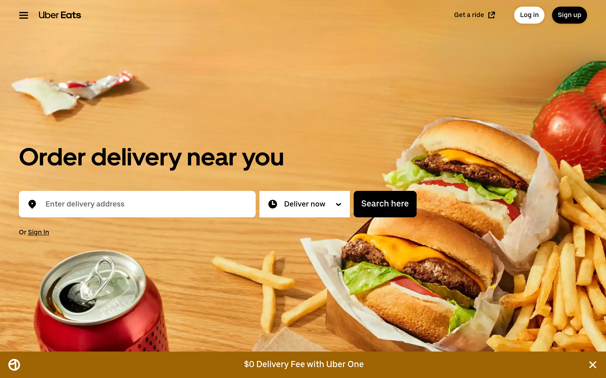

# ubereats DESIGN.md

> Auto-generated design system — reverse-engineered via static analysis by skillui.
> Frameworks: None detected
> Colors: 20 · Fonts: 2 · Components: 7
> Icon library: not detected · State: not detected
> Primary theme: light · Dark mode toggle: no · Motion: subtle

## Visual Reference

**Match this design exactly** — study colors, fonts, spacing, and component shapes before writing any UI code.



---

## 1. Visual Theme & Atmosphere

This is a **light-themed** interface with a cool, approachable feel. The light background emphasizes content clarity. Typography pairs **UberMoveText** for display/headings with **UberMove** for body text, creating clear visual hierarchy through type contrast. Spacing follows a **4px base grid** (compact density), with scale: 2, 4, 8, 10, 12, 14, 16, 18px. The accent color **#dfeffe** anchors interactive elements (buttons, links, focus rings). Motion is subtle — smooth transitions (150-300ms) ease state changes without drawing attention.

---

## 2. Color Palette & Roles

| Token | Hex | Role | Use |
|---|---|---|---|
| base-background-material-primary | `#ffffff` | background | Page background, darkest surface |
| base-error-background-disabled | `#fee6e1` | surface | Card and panel backgrounds |
| theme-color | `#000000` | text-primary | Headings and body text |
| base-border-subtle | `#6b6b6b` | text-muted | Captions, placeholders, secondary info |
| base-background-material-primary | `#272727` | border | Dividers, card borders, outlines |
| base-accent-background-primary-disabled | `#dfeffe` | accent | CTAs, links, focus rings, active states |
| base-accent-border-primary-subtle | `#afd7fd` | accent | CTAs, links, focus rings, active states |
| base-warning-border-subtle | `#ffb984` | accent | CTAs, links, focus rings, active states |
| base-error-background-statelayer-hover | `#3a0501` | danger | Error states, destructive actions |
| base-success-border-subtle | `#75e190` | success | Success states, positive indicators |
| base-background-statelayer-hover | `#111111` | unknown | Palette color |
| base-background-disabled | `#e0e0e0` | unknown | Palette color |
| base-background-inverse-statelayer-hover | `#ececec` | unknown | Palette color |
| base-border-inverse-subtle | `#474747` | unknown | Palette color |
| base-background-disabled | `#5f5f5f` | unknown | Palette color |
| base-border-subtle | `#c4c4c4` | unknown | Palette color |
| base-error-border-subtle | `#feac9c` | unknown | Palette color |
| base-error-background-disabled | `#4e0600` | unknown | Palette color |
| base-success-border-subtle | `#17904e` | unknown | Palette color |
| base-success-background-disabled | `#ccfbcb` | unknown | Palette color |

### CSS Variable Tokens

```css
--base-background-base: var(--base-neutral-99);
--base-background-primary: var(--base-neutral-100);
--base-background-secondary: var(--base-neutral-98);
--base-background-tertiary: var(--base-neutral-96);
--base-background-disabled: rgba(224,224,224,0.6);
--base-error-background-bold: var(--base-red-53);
--base-error-background-subtle: var(--base-red-96);
--base-error-background-disabled: rgba(254,230,225,0.75);
--base-error-background-statelayer-hover: rgba(254,230,225,0.25);
--base-error-background-statelayer-pressed: rgba(254,230,225,0.5);
--base-warning-background-bold: var(--base-orange-74);
--base-warning-background-subtle: var(--base-orange-96);
--base-warning-background-disabled: rgba(255,232,214,0.75);
--base-success-background-bold: var(--base-green-53);
--base-success-background-subtle: var(--base-green-98);
--base-success-background-disabled: rgba(204,251,203,0.75);
--base-info-background-bold: var(--base-neutral-18);
--base-info-background-subtle: var(--base-neutral-96);
--base-info-background-disabled: rgba(224,224,224,0.75);
--base-accent-background-primary-bold: var(--base-blue-57);
```


---

## 3. Typography Rules

**Font Stack:**
- **UberMove** — Heading 1, Heading 2, Heading 3
- **UberMoveText** — Body, Caption

**Font Sources:**

```css
@font-face {
  font-family: "UberMove";
  src: url("fonts/UberMove-Regular.woff2") format("woff2");
  font-weight: 400;
}
@font-face {
  font-family: "UberMove";
  src: url("fonts/UberMove-700.woff2") format("woff2");
  font-weight: 700;
}
@font-face {
  font-family: "UberMoveText";
  src: url("fonts/UberMoveText-Regular.woff2") format("woff2");
  font-weight: 400;
}
@font-face {
  font-family: "SpeedeeApp";
  src: url("fonts/SpeedeeApp-Regular.woff2") format("woff2");
  font-weight: 400;
}
@font-face {
  font-family: "Postmates";
  src: url("fonts/Postmates-Regular.woff2") format("woff2");
  font-weight: 400;
}
@font-face {
  font-family: "Postmates";
  src: url("fonts/Postmates-700.woff2") format("woff2");
  font-weight: 700;
}
@font-face {
  font-family: "GTAmerican";
  src: url("fonts/GTAmerican-Regular.woff") format("woff");
  font-weight: 400;
}
@font-face {
  font-family: "Montserrat";
  src: url("fonts/Montserrat-Bold.ttf") format("truetype");
  font-weight: 700;
}
@font-face {
  font-family: "Montserrat";
  src: url("fonts/Montserrat-Regular.ttf") format("truetype");
  font-weight: 400;
}
@font-face {
  font-family: "OrchidText";
  src: url("fonts/OrchidText-Regular.woff2") format("woff2");
  font-weight: 400;
}
@font-face {
  font-family: "OrchidTextSemibold";
  src: url("fonts/OrchidTextSemibold-600.woff2") format("woff2");
  font-weight: 600;
}
@font-face {
  font-family: "OrchidSubheadSemibold";
  src: url("fonts/OrchidSubheadSemibold-700.woff2") format("woff2");
  font-weight: 700;
}
@font-face {
  font-family: "OrchidSubtitleBold";
  src: url("fonts/OrchidSubtitleBold-700.woff2") format("woff2");
  font-weight: 700;
}
```

| Role | Font | Size | Weight |
|---|---|---|---|
| Heading 1 | UberMove | 52px | 700 |
| Heading 2 | UberMove | 36px | 700 |
| Heading 3 | UberMove | 28px | 700 |
| Body | UberMoveText | 16px | 400 |
| Caption | UberMoveText | 14px | 400 |

**Typographic Rules:**
- Limit to 2 font families max per screen
- Use **UberMove** for body/UI text, **UberMoveText** for display/headings
- Maintain consistent hierarchy: no more than 3-4 font sizes per screen
- Headings use bold (600-700), body uses regular (400)
- Line height: 1.5 for body text, 1.2 for headings
- Use color and opacity for secondary hierarchy, not additional font sizes


---

## 4. Component Stylings

### Layout (1)

**Footer** — `html`

### Navigation (1)

**Navigation** — `html`

### Data Input (2)

**Button** — `html`
- Animation: 

**Input** — `html`
- State: :focus, :placeholder

### Media (3)

**Image** — `html`

**Icon** — `html`

**Map/Canvas** — `html`


---

## 5. Layout Principles

- **Base spacing unit:** 4px
- **Spacing scale:** 2, 4, 8, 10, 12, 14, 16, 18, 20, 24, 28, 32
- **Border radius:** 4px, 8px, 12px, 15%, 500px
- **Max content width:** 1280px

**Spacing as Meaning:**
| Spacing | Use |
|---|---|
| 4-8px | Tight: related items within a group |
| 12-16px | Medium: between groups |
| 24-32px | Wide: between sections |
| 48px+ | Vast: major section breaks |


---

## 6. Depth & Elevation

### Flat — subtle depth hints

- `0 0 0 2px #276EF1`
- `inset 0 0 0 2px #FFFFFF,0 0 0 2px #276EF1`
- `inset 0px -1px 0px #F3F3F3`

### Raised — cards, buttons, interactive elements

- `0px 0px 8px rgba(0,0,0,0.1),0px 4px 4px rgba(0,0,0,0.04)`
- `0 1px 4px hsla(0,0%,0%,0.16)`
- `rgba(0, 0, 0, 0.1) 0px 0px 8px 0px, rgba(0, 0, 0, 0.04) 0px 4px 4px 0px`

### Floating — dropdowns, popovers, modals

- `0px 0px 10px rgba(0,0,0,0.1)`
- `rgba(0, 0, 0, 0.16) 0px 4px 16px 0px`

### Overlay — full-screen overlays, top-level dialogs

- `0px 0px 25px rgba(0,0,0,0.1)`
- `inset 999px 999px 0px rgba(0,0,0,0.08)`
- `inset 999px 999px 0px rgba(0,0,0,0.04)`

### Z-Index Scale

`0, 1, 2, 5, 6, 8`


---

## 7. Animation & Motion

This project uses **subtle motion**. Transitions smooth state changes without demanding attention.

### CSS Animations

- `@keyframes _ae`
- `@keyframes loadingAnimation`

### Animated Components

- **Button**: 

### Motion Guidelines

- Duration: 150-300ms for micro-interactions, 300-500ms for page transitions
- Easing: `ease-out` for enters, `ease-in` for exits
- Always respect `prefers-reduced-motion`


---

## 8. Do's and Don'ts

### Do's

- Use `#dfeffe` for interactive elements (buttons, links, focus rings)
- Use `#ffffff` as the primary page background
- Pair **UberMove** (body) with **UberMoveText** (display) — these are the only allowed fonts
- Follow the **4px** spacing grid for all margins, padding, and gaps
- Use the defined shadow tokens for elevation — see Section 6
- Use border-radius from the scale: 4px, 8px, 12px, 15%, 500px
- Reuse existing components from Section 4 before creating new ones

### Don'ts

- Don't introduce colors outside this palette — extend the design tokens first
- Don't introduce additional font families beyond UberMove and UberMoveText
- Don't use arbitrary spacing values — stick to multiples of 4px
- Don't create custom box-shadow values outside the system tokens
- Don't use arbitrary border-radius values — pick from the defined scale
- Don't duplicate component patterns — check Section 4 first
- Don't use backdrop-blur or blur effects

### Anti-Patterns (detected from codebase)

- No blur or backdrop-blur effects
- No zebra striping on tables/lists


---

## 9. Responsive Behavior

No breakpoints detected. Consider adding responsive breakpoints to the design system.

---

## 10. Agent Prompt Guide

Use these as starting points when building new UI:

### Build a Card

```
Background: #fee6e1
Border: 1px solid #272727
Radius: 12px
Padding: 16px
Font: UberMove
Use shadow tokens from Section 6.
```

### Build a Button

```
Primary: bg #dfeffe, text white
Ghost: bg transparent, border #272727
Padding: 8px 16px
Radius: 12px
Hover: opacity 0.9 or lighter shade
Focus: ring with #dfeffe
```

### Build a Page Layout

```
Background: #ffffff
Max-width: 1280px, centered
Grid: 4px base
Responsive: mobile-first, breakpoints from Section 9
```

### Build a Stats Card

```
Surface: #fee6e1
Label: #6b6b6b (muted, 12px, uppercase)
Value: #000000 (primary, 24-32px, bold)
Status: use success/warning/danger from Section 2
```

### Build a Form

```
Input bg: #ffffff
Input border: 1px solid #272727
Focus: border-color #dfeffe
Label: #6b6b6b 12px
Spacing: 16px between fields
Radius: 12px
```

### General Component

```
1. Read DESIGN.md Sections 2-6 for tokens
2. Colors: only from palette
3. Font: UberMove, type scale from Section 3
4. Spacing: 4px grid
5. Components: match patterns from Section 4
6. Elevation: shadow tokens
```
