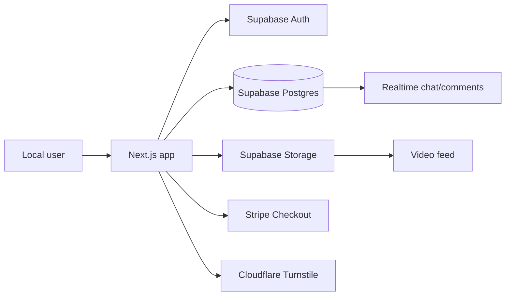

# Localys

Localys is a local discovery app built around short video, business profiles, shareable collections, chat, maps, menus, coupons, and lightweight commerce. Think neighborhood guide, creator feed, and small-business storefront sharing the same room.

This folder contains the Next.js app.


## What Is Here

Localys has a few main surfaces:

| Surface | Path | Notes |
| --- | --- | --- |
| Home discovery | `/` | Search, categories, horizontal video carousel, collections, map |
| Search | `/search` | Business and video search modes |
| Video detail | `/video/[id]` | Video playback, likes, comments, profile/business actions |
| Collections | `/collections`, `/collections/[slug]` | Shareable lists of local businesses with likes |
| Profiles | `/profile`, `/profile/[userId]` | User and business profile views |
| Upload | `/upload` | Video upload and promotion flow |
| Messaging | `/chats`, `/chats/[id]` | One-to-one chat system |
| Orders | `/cart`, `/checkout`, `/orders/verify` | Item checkout and verification |
| Coins | `/buy-coins` | Stripe-backed coin purchases for promotion |

## Stack

- Next.js App Router
- React 19
- Supabase Auth, Postgres, Storage, and Realtime
- Stripe Checkout
- Cloudflare Turnstile for auth abuse protection
- Leaflet / React Leaflet for maps
- Tailwind CSS via PostCSS



## Local Setup

Install dependencies:

```bash
npm install
```

Start the dev server:

```bash
npm run dev
```

Open:

```text
http://localhost:3000
```

If port `3000` is busy, Next will usually ask for another port. The app also runs fine on `3001`, `3002`, and so on.

## Environment

Copy `.env.example` to `.env.local` and fill in the values you need.

Core values:

```bash
NEXT_PUBLIC_SUPABASE_URL=
NEXT_PUBLIC_SUPABASE_ANON_KEY=
NEXT_PUBLIC_SUPABASE_BUCKET=videos
```

Server-only values used by checkout and verification routes:

```bash
SUPABASE_SERVICE_ROLE_KEY=
STRIPE_SECRET_KEY=
NEXT_PUBLIC_STRIPE_PUBLISHABLE_KEY=
```

Turnstile values:

```bash
NEXT_PUBLIC_TURNSTILE_SITE_KEY=
NEXT_PUBLIC_TURNSTILE_SITE_KEY_LOCAL=
NEXT_PUBLIC_TURNSTILE_ENABLED_IN_DEV=false
TURNSTILE_ENABLED_IN_DEV=false
TURNSTILE_SECRET_KEY=
```

In production, server-side Turnstile verification is enforced. If you see Turnstile error `110200`, the site key does not match the current hostname. Add the domain in Cloudflare Turnstile and use the matching key.

## Database

Migrations live in `supabase/migrations`.

Important recent migrations:

| Migration | Purpose |
| --- | --- |
| `030_add_order_verification.sql` | Order verification flow |
| `031_add_business_collections.sql` | Shareable business collections and collection likes |
| `20260119024400_add_chats_and_messages.sql` | Chat and messaging tables |

Run migrations through your Supabase workflow, or paste individual SQL files into the Supabase SQL editor while developing.

The collections feature expects:

- `business_collections`
- `business_collection_items`
- `business_collection_likes`

Collection items point at `profiles.id`, because this app treats business accounts as profile records with business-like `type` values such as `food`, `retail`, and `service`.

## Scripts

| Command | What it does |
| --- | --- |
| `npm run dev` | Start local development |
| `npm run build` | Build for production |
| `npm start` | Start a production build |
| `npm run lint` | Run ESLint |
| `npx tsc --noEmit` | Type-check without writing build output |

On Windows PowerShell, script execution policy can block `npm.ps1` or `npx.ps1`. Use the command shims if that happens:

```powershell
npm.cmd run dev
npx.cmd tsc --noEmit
```

## Project Map

```text
app/                 Routes, pages, API handlers
components/          Shared UI and feature components
contexts/            Auth, language, cart, activity, theme providers
hooks/               Reusable client hooks
lib/supabase/        Supabase data access helpers
models/              TypeScript models
services/            Thin service wrappers
supabase/migrations/ Database schema changes
```

## Useful Development Notes

- The feed uses Supabase Storage URLs. Some paths are signed at runtime in `lib/supabase/videos.ts`.
- The homepage video carousel pulls from `getVideosFeed(12)`.
- Business discovery mostly reads from `profiles`, while some older flows still touch `businesses`.
- Full repo lint currently includes older strictness issues in unrelated files. When working on a focused change, run ESLint against touched files first.
- The app layout includes global bottom navigation and desktop sidebar, so individual pages usually should not add a second full app shell.

## Naming

The product name should be written as `Localys` in docs, metadata, and UI copy.

## Handy URLs

```text
/                    Home
/search              Search businesses and videos
/collections         Community collections
/upload              Upload a video
/profile             Your profile
/chats               Messages
/buy-coins           Buy promotion coins
```
